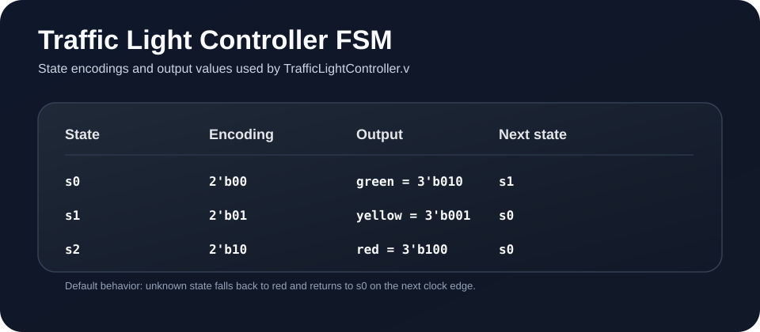
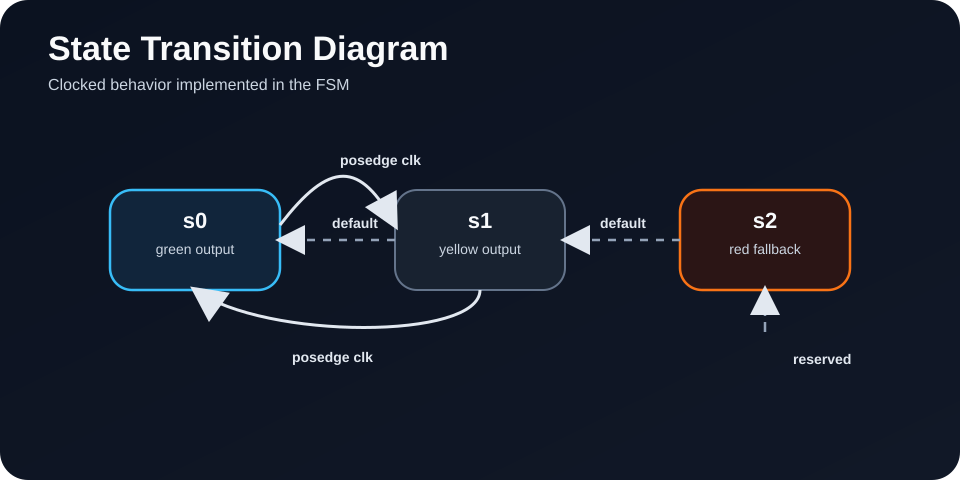

# Traffic Light Controller FSM

This project contains a simple clocked traffic light controller written in Verilog. It cycles through a small finite state machine and drives a 3-bit light output for red, yellow, and green.

## Overview

The controller is implemented in [TrafficLightController.v](TrafficLightController.v) and exercised by [tlc_tb.v](tlc_tb.v). On every rising edge of `clk`, the FSM updates the `light` output and advances to the next state.

## State Images





## FSM Behavior

The design uses three symbolic states:

| State | Encoding | Output | Next state |
| --- | --- | --- | --- |
| `s0` | `2'b00` | `green = 3'b010` | `s1` |
| `s1` | `2'b01` | `yellow = 3'b001` | `s0` |
| `s2` | `2'b10` | `red = 3'b100` | `s0` |

If the machine ever enters an unknown value, the `default` branch forces the light to red and returns the controller to `s0`.

## Files

- [TrafficLightController.v](TrafficLightController.v): the FSM implementation
- [tlc_tb.v](tlc_tb.v): a basic testbench with a generated clock and waveform dump
- [state_encoding.svg](state_encoding.svg): visual summary of the states and outputs
- [state_diagram.svg](state_diagram.svg): state transition diagram

## Simulation

The testbench runs for 50 ns and prints the clock and light values to the console while generating `dump.vcd` for waveform viewing.

Example with Icarus Verilog:

```bash
iverilog -o tlc_tb tlc_tb.v TrafficLightController.v
vvp tlc_tb
```

Open `dump.vcd` in your waveform viewer to inspect the timing of the transitions.

## Notes

The current implementation uses a minimal FSM, so `s2` is defined as a red fallback state but is not reached by the normal transition path in the existing code.
